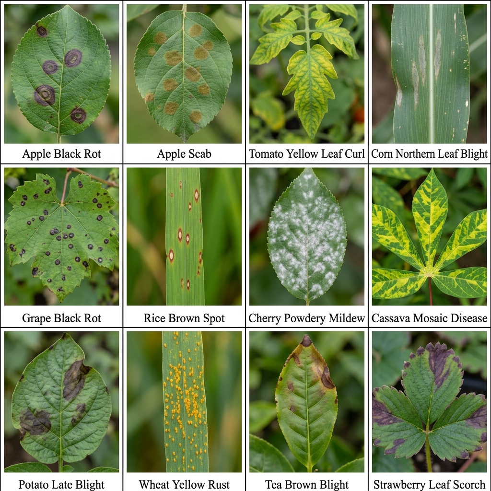
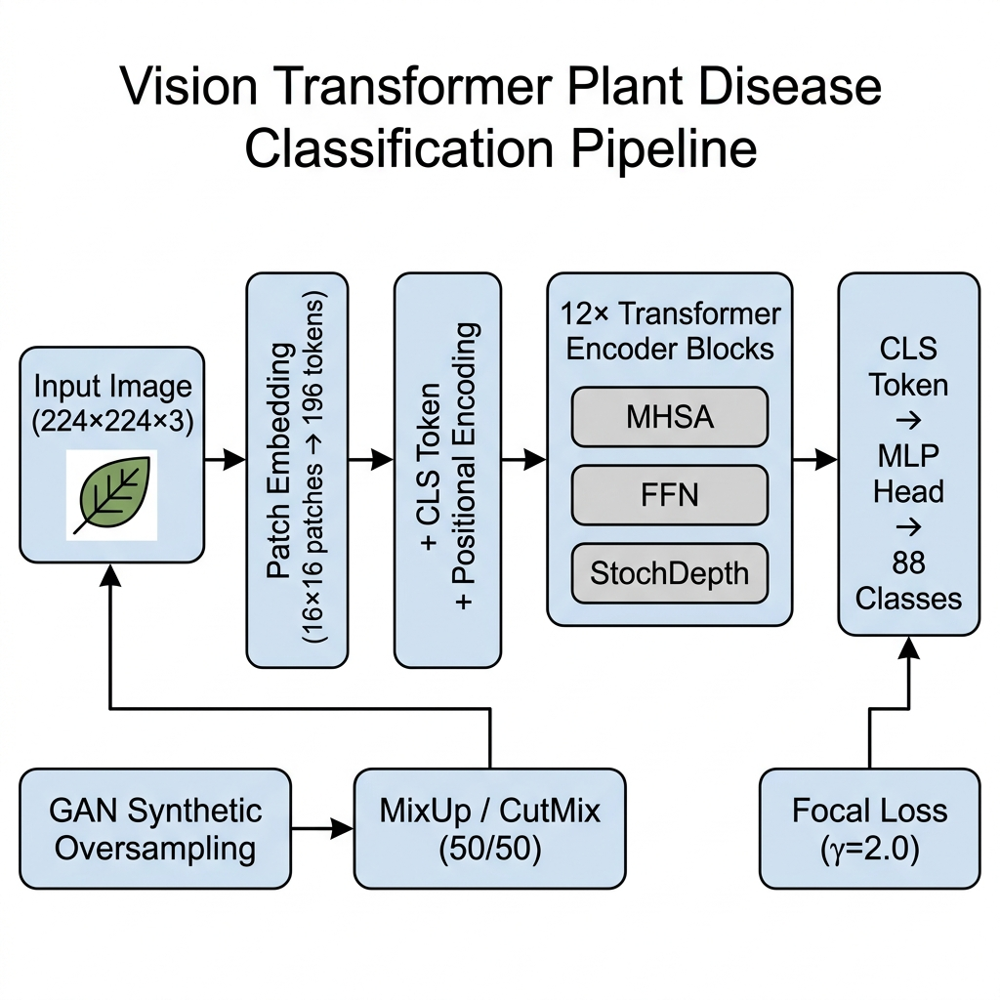
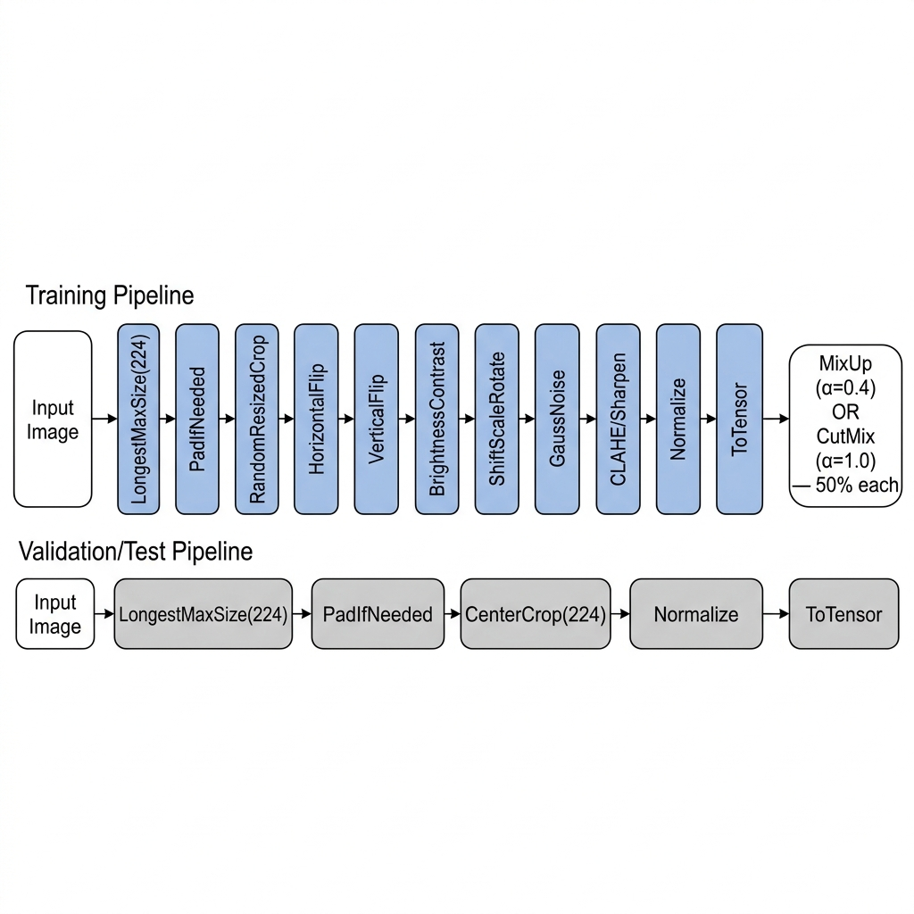
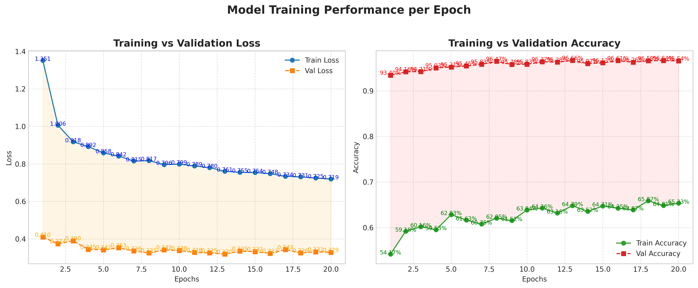
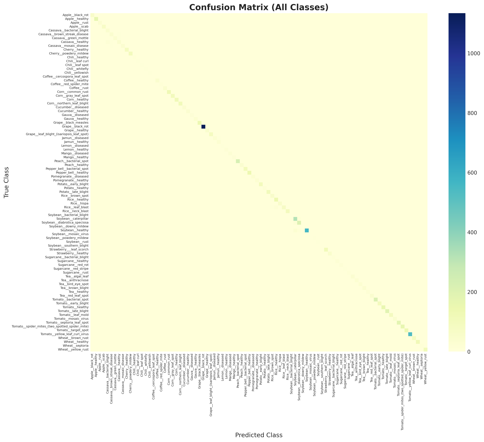
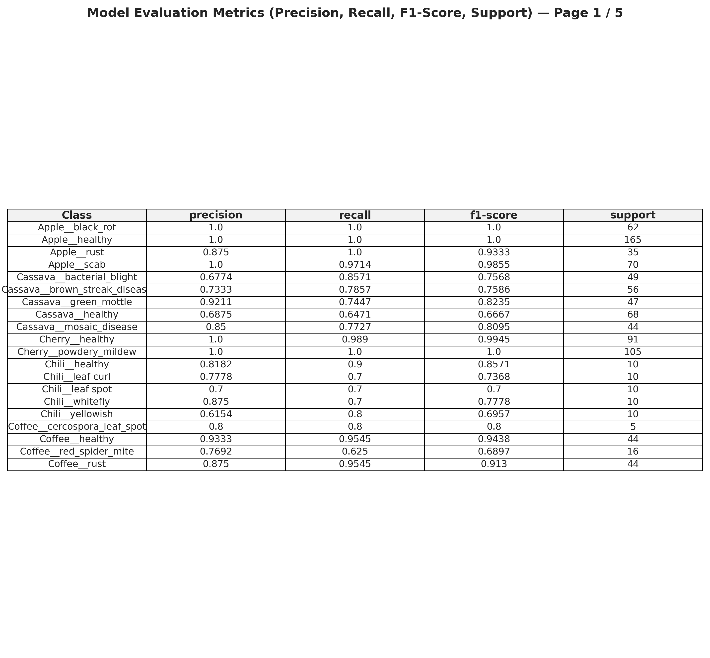
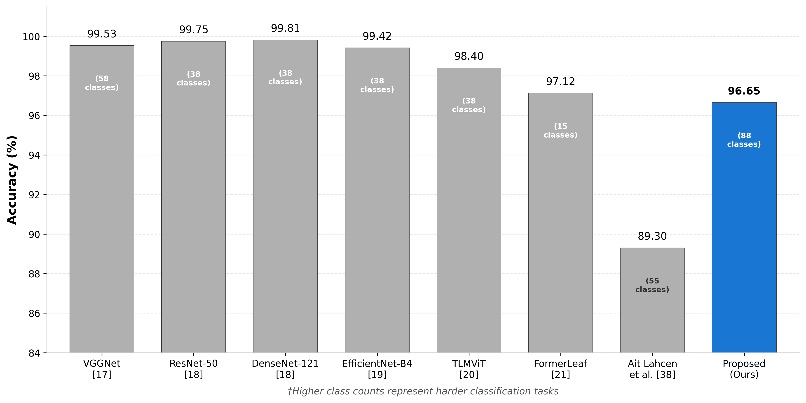
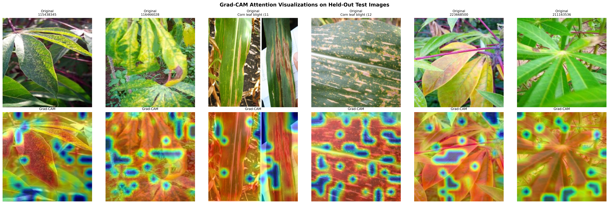

<div align="center">

# 🌿 LeafSense-AI — Training & Research

### Vision Transformer-Based Multi-Class Plant Disease Detection with Hybrid Augmentation and Generative Oversampling

[](https://pytorch.org/)
[](https://github.com/huggingface/pytorch-image-models)
[](https://aws.amazon.com/)
[]()

**96.65% accuracy across 88 plant disease classes — trained on NVIDIA T4 GPU with MixUp, CutMix, Focal Loss, and GAN-based oversampling.**

</div>

> _This project demonstrates how Vision Transformers can outperform traditional approaches in real-world, imbalanced agricultural datasets — not just controlled benchmarks._

---

## 📸 Visual Preview


*Representative samples from 12 of our 88 disease classes — notice how visually similar some diseases appear across different plant species.*

---

## ⚡ TL;DR (30-Second Overview)

- Built a **Vision Transformer (DeiT-Base)** model for plant disease detection from scratch
- Solved extreme class imbalance using **GAN + Focal Loss + Weighted Sampling** — a three-pronged approach
- Achieved **96.65% test accuracy** on 88 classes (test set: 8,124 images)
- Outperformed baseline paper (~89.3% on 55 classes) by **+7.35% absolute points**
- Full training + evaluation pipeline designed and executed on **AWS EC2 g4dn.xlarge** (NVIDIA T4, 16GB VRAM)

---

## 📑 Table of Contents

1. [Problem Statement](#1-problem-statement)
2. [Model Architecture — DeiT-Base](#2-model-architecture--deit-base)
3. [Data Engineering Pipeline](#3-data-engineering-pipeline)
4. [Training Pipeline](#4-training-pipeline)
5. [Results & Analysis](#5-results--analysis)
6. [⚠️ Why Validation > Training Accuracy (Not Overfitting!)](#6-️-why-validation--training-accuracy-not-overfitting)
7. [Per-Class Performance Deep Dive](#7-per-class-performance-deep-dive)
8. [Comparison with Base Paper](#8-comparison-with-base-paper)
9. [Grad-CAM Attention Visualization](#9-grad-cam-attention-visualization)
10. [Project Structure & Code Mapping](#10-project-structure--code-mapping)
11. [Getting Started](#11-getting-started)
12. [Production Deployment](#12-production-deployment)
13. [Limitations & Future Work](#13-limitations--future-work)
14. [Citation & License](#14-citation--license)

---

## 1. Problem Statement

> 🌾 *Crop diseases cause up to **40% annual yield loss** globally. Manual expert diagnosis is slow, expensive, and does not scale. This project builds an AI system that diagnoses 88 plant diseases from a single leaf photograph with 96.65% accuracy.*

Plant disease detection is a **fine-grained visual classification** problem. The core challenges aren't "can we build a classifier" — it's _why standard classifiers fail_:

- **Intra-class variance:** A single disease (e.g., Cassava Mosaic) looks completely different depending on severity, lighting, and leaf age.
- **Inter-class similarity:** Apple Scab and Apple Black Rot share nearly identical early-stage visual signatures.
- **Long-tail distribution:** Our dataset contains 1,139 test samples for `Grape_black_rot` but only 2 for `Soybean_mosaic_virus`. A naive model ignores the rare classes entirely.

These are the specific engineering problems this project was built to solve.

---

## 2. Model Architecture — DeiT-Base

We chose **DeiT-Base** (`deit_base_patch16_224`) over ResNet/EfficientNet for a specific reason: CNNs process images through stacked convolutional filters with limited receptive fields. A 3×3 kernel at layer 1 sees 3×3 pixels. Vision Transformers solve this by design — every patch attends to every other patch from the first layer via **Multi-Head Self-Attention**. A necrotic spot at the leaf tip is directly compared to yellowing at the base in a single forward pass.

**Why DeiT specifically?** Standard ViT requires pre-training on JFT-300M (300 million images). DeiT introduces a distillation token that makes it data-efficient enough to fine-tune on our ~81K image dataset.


*End-to-end pipeline: from raw leaf image through patch embedding, transformer encoding, to 88-class prediction.*

| Parameter | Value |
|:---|:---|
| Backbone | `deit_base_patch16_224` |
| Input Resolution | 224 × 224 |
| Patch Size | 16 × 16 (196 tokens) |
| Embedding Dimension | 768 |
| Transformer Layers | 12 |
| Attention Heads | 12 |
| Total Parameters | **85.8M** |
| Stochastic Depth | drop_path_rate = 0.1 |

---

## 3. Data Engineering Pipeline

### 3.1 Dataset & Split Strategy

- **Total Images:** ~81,000 across 88 disease categories (including healthy leaves)
- **Split:** Stratified 80/10/10 (Train/Val/Test) using `StratifiedShuffleSplit` — guarantees proportional class representation
- **Test Set:** 8,124 images

### 3.2 Augmentation Pipeline


*Training images pass through heavy augmentation; validation/test images receive only resize + center crop + normalization.*

| Augmentation | Purpose |
|:---|:---|
| `RandomResizedCrop(scale=0.6–1.0)` | Forces scale invariance |
| `HorizontalFlip` + `VerticalFlip` | Orientation invariance |
| `ShiftScaleRotate(rotate=±25°)` | Handles field photography angles |
| `GaussNoise` | Simulates low-quality phone cameras |
| `CLAHE` / `Sharpen` | Enhances edge and texture features |
| `RandomBrightnessContrast` | Handles variable outdoor lighting |

### 3.3 GAN-Based Synthetic Oversampling

For classes with severe data scarcity, we built a **class-conditional DCGAN** ([`src/gan.py`](src/gan.py)):

- **Generator:** Noise vector (128-dim) + class embedding (50-dim) → ConvTranspose2d upsampling → synthetic leaf image
- **Discriminator:** Conv2d downsampling with projection discrimination for class-conditional adversarial training
- **Why GAN over SMOTE?** SMOTE interpolates feature vectors and produces blurry artifacts. Our GAN learns the actual pixel distribution, generating novel venation patterns and spot morphologies.

### 3.4 Class Balancing — WeightedRandomSampler

Even after GAN oversampling, residual imbalance remains. We compute inverse-frequency weights per class and construct a `WeightedRandomSampler` to ensure every training batch contains balanced representation.

---

## 4. Training Pipeline

[`src/train.py`](src/train.py) orchestrates the full training loop:

### Loss Function: Focal Loss (γ=2.0)
The $(1 - p_t)^{γ}$ modulating factor means a sample classified with 90% confidence contributes only 1% of its normal loss, while a misclassified sample at 20% confidence contributes 64%. This forces gradient attention toward hard, minority-class examples.

### Hybrid Augmentation: MixUp + CutMix (50/50 per batch)
Every training batch randomly undergoes either **MixUp** (α=0.4) — linear blending of two images — or **CutMix** (α=1.0) — patch-based mixing. This creates continuous decision boundaries and prevents background memorization.

### Optimizer & Training Config

| Component | Choice |
|:---|:---|
| Optimizer | AdamW (lr=1e-4, weight_decay=1e-2) |
| Scheduler | CosineAnnealingLR (T_max=50) |
| Gradient Clipping | max_norm=1.0 |
| Mixed Precision | FP16 via `torch.cuda.amp` |
| Batch Size | 32 (with 4× Gradient Accumulation = effective 128) |
| Early Stopping | patience=7 epochs |
| Training Duration | 20 epochs (converged, early stopping triggered) |

### Test-Time Augmentation (TTA)
During final evaluation, each test image is run 3 times: original + horizontal flip + vertical flip. Predictions are averaged for reduced variance.

---

## 5. Results & Analysis

### Final Performance

| Metric | Score |
|:---|:---|
| **Overall Accuracy** | **96.65%** |
| **Weighted Precision** | **96.81%** |
| **Weighted Recall** | **96.65%** |
| **Weighted F1-Score** | **96.66%** |
| **Macro Avg F1-Score** | **93.98%** |

> The gap between weighted F1 (96.66%) and macro F1 (93.98%) reveals that minority classes pull down the unweighted average — this is expected and analyzed in [Section 7](#7-per-class-performance-deep-dive).

### Training Curves


*Training ran for 20 epochs before Early Stopping triggered. Notice the training/validation accuracy gap — this is intentional and explained in [Section 6](#6-️-why-validation--training-accuracy-not-overfitting).*

### Confusion Matrix


*88×88 confusion matrix showing near-perfect diagonal dominance. Off-diagonal spots primarily occur in the Cassava and Chili clusters due to extreme visual similarity.*

### Per-Class Evaluation Table


*First page of the per-class precision, recall, and F1-score breakdown. Full report: [classwise_metrics.csv](./outputs/classwise_metrics.csv)*

---

## 6. ⚠️ Why Validation > Training Accuracy (Not Overfitting!)

**This is the most commonly misunderstood metric in this project, and it deserves a clear explanation.**

If you look at our training curves, you'll notice something that seems backwards:
- **Training accuracy: ~65%**
- **Validation accuracy: ~96.6%**

At first glance, this looks broken. In most ML projects, high validation accuracy with low training accuracy would suggest data leakage or a bug. But in our case, **this gap is the direct, expected consequence of our augmentation strategy**, and it's actually proof that the model is learning robust features rather than memorizing.

Here's exactly what's happening:

### During Training — The Model Sees "Impossible" Images

Every single training batch undergoes either **MixUp** or **CutMix**:

- **MixUp** blends two images together (e.g., 60% Apple Scab + 40% Corn Rust). The resulting image is a ghostly overlay of two completely different diseases. The model is trained on soft probability labels matching that ratio.
- **CutMix** pastes a rectangular patch from one image onto another. The model sees an Apple leaf with a chunk of Tomato leaf pasted in the corner.

When we compute "training accuracy," we compare `argmax(predictions)` against the **original hard label**. But the model was trained to predict a **soft distribution** (e.g., 60% class A, 40% class B). Even a perfect model would appear to get many predictions "wrong" when judged against a single hard label. **The training accuracy metric is fundamentally unfair to a model trained on mixed labels.**

### During Validation — The Model Sees Clean Images

Validation images receive **zero augmentation** — just resize, center crop, and normalization. The model processes the original, unmodified leaf and makes a single hard prediction. This reveals the model's true learned capability, unhampered by the artificial difficulty of blended inputs.

### Additionally: Stochastic Depth (DropPath)

During training, our model randomly drops entire transformer layers (`drop_path_rate=0.1`). This means the model is literally operating with a handicap during training — random layers are "turned off." During validation, the full network is active, producing an ensemble-like effect that naturally boosts performance.

### The Bottom Line

> **If training accuracy were 99% and validation were 96%, _that_ would indicate memorization (overfitting). Our pattern — where the model can't memorize because training data is constantly being scrambled — is the signature of a well-regularized model.**

This is a well-documented phenomenon in the MixUp/CutMix literature (Zhang et al., 2018; Yun et al., 2019) and is expected behavior when using these augmentation techniques.

---

## 7. Per-Class Performance Deep Dive

### 🏆 Perfect Classifiers (F1 = 1.00)

| Class | Precision | Recall | F1 | Support |
|:---|:---|:---|:---|:---|
| Apple_black_rot | 1.000 | 1.000 | 1.000 | 62 |
| Apple_healthy | 1.000 | 1.000 | 1.000 | 165 |
| Cherry_powdery_mildew | 1.000 | 1.000 | 1.000 | 105 |
| Corn_healthy | 1.000 | 1.000 | 1.000 | 116 |
| Grape_black_measles | 1.000 | 1.000 | 1.000 | 139 |
| All 6 Tea classes | 1.000 | 1.000 | 1.000 | 193 |
| All 4 Wheat classes | 1.000 | 1.000 | 1.000 | 337 |

### ⚠️ Weakest Performers — and Why

| Class | F1 | Support | Root Cause |
|:---|:---|:---|:---|
| Cassava_healthy | 0.667 | 68 | Visually indistinguishable from mild mosaic disease |
| Chili_yellowish | 0.696 | 10 | Only 10 test samples — 2 errors tank the precision |
| Coffee_red_spider_mite | 0.690 | 16 | Low sample count + subtle visual markers |
| Chili_leaf_spot | 0.700 | 10 | Highly ambiguous with `Chili_leaf_curl` |

**Pattern:** Weak classes cluster in two categories: (1) the **Cassava family** — visually ambiguous even to agricultural experts, and (2) the **Chili family** — extremely low sample counts combined with high inter-class similarity.

---

## 8. Comparison with Base Paper


*Our model (blue) achieves 96.65% on 88 classes — the hardest classification task in this comparison. Higher class counts represent harder problems.*

| Attribute | Base Paper | LeafSense-AI (Ours) |
|:---|:---|:---|
| **Architecture** | Standard ViT | **DeiT-Base** (distilled) |
| **Classes** | 55 | **88** (+60% harder) |
| **Test Accuracy** | ~89.3% | **96.65%** (+7.35%) |
| **Augmentation** | Basic flips & color jitter | **MixUp + CutMix + Albumentations** |
| **Loss Function** | Cross-Entropy | **Focal Loss (γ=2.0)** |
| **Class Balancing** | None | **WeightedRandomSampler + GAN** |
| **Stochastic Depth** | Not used | **drop_path=0.1** |
| **TTA** | Not used | **3-view ensemble** |

The improvement comes from three compounding factors: Focal Loss redirects gradients to hard samples, MixUp/CutMix creates robust decision boundaries, and WeightedRandomSampler ensures balanced exposure.

---

## 9. Grad-CAM Attention Visualization


*Grad-CAM attention maps on held-out test images. The model correctly focuses on diseased leaf regions (lesions, spots, discoloration) rather than background features — confirming that our augmentation strategy prevented background memorization.*

---

## 10. Project Structure & Code Mapping

```
LeafSense-AI-Research-Repository/
├── src/
│   ├── model.py           # DeiT-Base initialization via timm
│   ├── dataset.py         # Stratified splits + WeightedRandomSampler + Albumentations
│   ├── train.py           # Training loop: MixUp/CutMix, AMP, Early Stopping, TTA
│   ├── utils.py           # FocalLoss, MixUp/CutMix functions, evaluation & plotting
│   ├── gan.py             # Class-conditional DCGAN (Generator + Discriminator)
│   ├── generate.py        # Synthetic image generation from GAN checkpoint
│   ├── eval_only.py       # Standalone evaluation with base-paper augmentations
│   └── test.py            # GPU availability check
├── outputs/
│   ├── training_curves_detailed.png
│   ├── confusion_matrix_detailed.png
│   ├── classwise_metrics.csv
│   ├── architecture.png
│   ├── dataset_samples.png
│   ├── gradcam_real.png
│   ├── performance_comparison.png
│   └── preprocessing_pipeline.png
├── requirements.txt
├── LICENSE
└── README.md
```

| File | What It Does |
|:---|:---|
| [`model.py`](src/model.py) | `timm.create_model()` with `drop_path_rate=0.1` for Stochastic Depth |
| [`dataset.py`](src/dataset.py) | `StratifiedShuffleSplit`, `WeightedRandomSampler`, `Albumentations`, synthetic data merging |
| [`train.py`](src/train.py) | MixUp/CutMix stochastic selection, AMP, gradient clipping, checkpoint resume, TTA |
| [`utils.py`](src/utils.py) | `FocalLoss`, `mixup_data()`, `cutmix_data()`, classification reports, confusion matrix |
| [`gan.py`](src/gan.py) | Conditional DCGAN with projection discrimination and BCEWithLogitsLoss |
| [`generate.py`](src/generate.py) | Synthesizes N images per class from trained generator checkpoint |
| [`eval_only.py`](src/eval_only.py) | Standalone evaluation mirroring base paper's augmentation for fair comparison |

---

## 11. Getting Started

### Prerequisites
- Python 3.8+
- NVIDIA GPU with ≥16GB VRAM (for batch_size=32)
- CUDA 11.x+

### Setup
```bash
git clone https://github.com/saketmathur04/-LeafSense-AI-Research-Repository.git
cd LeafSense-AI-Research-Repository

python -m venv venv
source venv/bin/activate  # On Windows: venv\Scripts\activate

pip install -r requirements.txt
```

### Train
```bash
# Optional: Generate synthetic data for minority classes first
python src/gan.py --data_dir ./data/plant-disease-classification-merged-dataset --epochs 120
python src/generate.py --ckpt ./gan_ckpts/G_epoch120.pth --out_dir ./synthetic --n_per_class 300

# Train the Vision Transformer
python src/train.py
```

### Evaluate
```bash
python src/eval_only.py --data ./data/plant-disease-classification-merged-dataset --ckpt checkpoints/latest_checkpoint.pth --out_dir eval_results
```

---

## 12. Production Deployment

This repository focuses on the **research and training pipeline**. The trained model is deployed as a full-stack application:

👉 **[LeafSense-AI Production App](https://github.com/saketmathur04/LeafSense-AI)**

- **Frontend:** React + Vite + TypeScript with shadcn/ui components, deployed on Vercel.
- **Backend:** Flask API serving the DeiT-Base model with real-time inference and non-leaf detection heuristics.
- **Model Hosting:** Weights hosted on [Hugging Face Model Hub](https://huggingface.co) (~1 GB `best_vit_model.pth`).
- **Live Demo:** Dockerized backend deployed as a [Hugging Face Space](https://huggingface.co/spaces) for instant browser-based diagnosis.

---

## 13. Limitations & Future Work

### Current Limitations
- **Cassava cluster confusion:** The 5 Cassava classes (F1 range: 0.66–0.82) share extreme visual similarity — even agricultural experts struggle with these.
- **Low-support classes:** Chili subclasses (10 samples each) lack statistical significance in their metrics.
- **Computational cost:** 85.8M parameters makes real-time mobile inference impractical without quantization.

### Future Work
1. **INT8 Quantization via TensorRT** — reduce model footprint for edge deployment on smartphones in low-connectivity rural areas.
2. **Targeted GAN augmentation** — train class-specific GANs for Cassava and Chili families to boost their F1 scores above 0.90.
3. **Multi-spectral imaging** — incorporate near-infrared data for pre-symptomatic detection (before visible symptoms appear).

---

## 🌱 Real-World Impact

- **Early disease detection** → reduces crop loss by enabling treatment before symptoms spread
- **Scalable diagnosis** → a single model replaces manual expert inspection across 88 disease categories
- **Mobile-ready pathway** → with INT8 quantization, deployable on smartphones for farmers in rural areas
- **Precision agriculture** → integrates into farm management systems for automated crop health monitoring

---

## 14. Citation & License

### Citation
```bibtex
@article{mathur2024leafsense,
  title={LeafSense-AI: Advanced Plant Disease Detection using Vision Transformers and GAN-based Oversampling},
  author={Mathur, Saket},
  journal={GitHub Repository},
  year={2024}
}
```

### License
This project is licensed under the MIT License — see the [LICENSE](LICENSE) file for details.

### Acknowledgements
- **[timm](https://github.com/huggingface/pytorch-image-models)** — PyTorch Image Models for DeiT implementations
- **[Albumentations](https://albumentations.ai/)** — powerful image augmentation pipeline
- **PlantVillage Dataset** — foundational plant disease image collection

---

<div align="center">

**Built with PyTorch · Trained on AWS · Powered by Vision Transformers**

</div>
